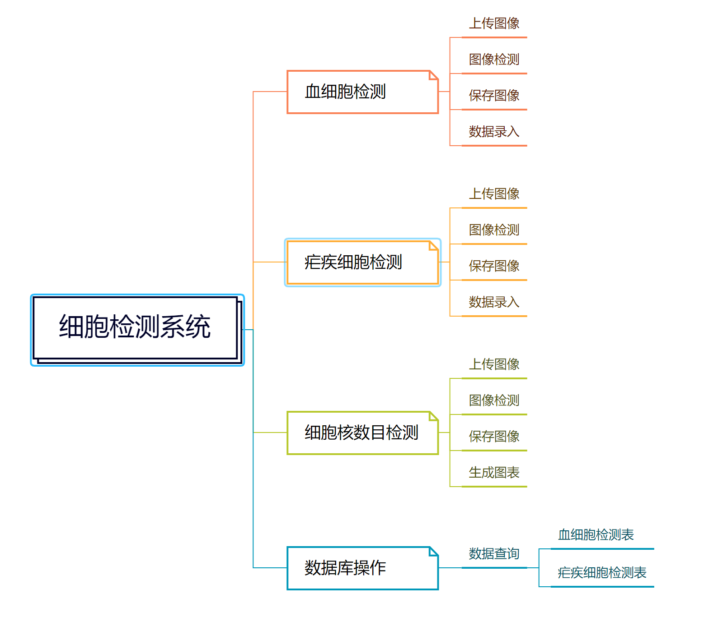

# 细胞检测系统

## 一、背景

细胞检测在医学、生物学和科学研究领域具有重要意义。通过自动化的细胞检测系统，可以快速、准确地分析细胞图像，并提取有关细胞类型、数量和结构的信息。这对于疾病诊断、药物研发、基因组学研究等方面都具有重要价值。

当前，深度学习技术在图像处理和计算机视觉领域取得了巨大进展。Yolov5模型是一种先进的目标检测模型，具有高准确性和较快的检测速度，适用于细胞检测任务。本项目将利用Yolov5模型开发一个细胞检测系统，以提高细胞分析的效率和准确性。

本项目研发的目的在于：

1. **自动化细胞检测**：传统的细胞检测方法通常需要人工操作和耗费大量时间。通过开发一个自动化的细胞检测系统，可以减轻人工工作负担，提高细胞分析的效率和准确性。

2. **精准的细胞分类和计数**：细胞检测系统能够快速而准确地对细胞图像进行分类和计数。这对于医生、研究人员和科学家来说是非常宝贵的，可以帮助他们更好地理解细胞结构和功能，加深对疾病发展和药物治疗的认识。

3. **疾病诊断和治疗**：细胞检测系统在疾病诊断和治疗方面有着广泛的应用。通过分析细胞图像，可以帮助医生快速发现异常细胞和病理特征，提供更早的疾病诊断和治疗方案。

4. **科学研究的推进**：细胞检测系统可以为科学研究提供强大的工具和支持。研究人员可以利用该系统对细胞图像进行快速的大规模分析和统计，探索细胞结构和功能之间的关联，推动科学研究的进展。

5. **数据管理和共享**：细胞检测系统还具备强大的数据管理和共享功能。通过将细胞图像和相关数据存储到数据库中，可以方便地进行数据检索、更新和分享，促进合作和知识共享。

## 二、项目需求列表

1. 血细胞检测：使用Yolov5模型对给定的图像进行血细胞检测。系统应能准确识别和标记图像中的血细胞，并提供相关统计信息，如血红细胞数目、白细胞数目等。
2. 疟疾细胞检测：使用Yolov5模型对给定的图像进行疟疾细胞检测。系统应能识别和标记图像中的疟疾细胞，并提供相关统计信息，如感染细胞数目、病原体类型等。
3. 细胞核数目检测：使用Yolov5模型对给定的图像进行细胞核数目检测。系统应能准确计算图像中细胞核的数量，并提供统计摘要和细胞核位置信息。
4. 数据库操作：系统应支持对细胞图像和相关数据的数据库操作。这包括存储、检索、更新和删除细胞图像及其相关数据的功能。系统还应提供数据导入和导出功能，以便与其他系统集成。

项目功能需求如下图所示：

## 三、非功能性需求

1. **性能要求**：系统应能在合理的时间内对给定的图像进行细胞检测，并能处理大规模的图像数据集。

2. **准确性**：系统应能以高准确率检测和标记图像中的细胞和细胞核，并提供可靠的统计信息。

3. **用户界面**：系统应具有用户友好的界面，使用户能够轻松导入图像、运行检测算法、查看和分析检测结果。

4. **安全性**：系统应采取必要的安全措施来保护存储在数据库中的细胞图像和相关数据，确保其不受未经授权的访问和恶意攻击的威胁。

5. **可扩展性**：系统应具备良好的可扩展性，以便将来能够集成更多的细胞检测算法或扩展功能。

6. **可维护性**：系统的代码应具备良好的可读性和可维护性，以便进行后续的bug修复、性能优化和功能扩展。

## 四、技术选型

1. **深度学习模型**：Yolov5

2. **数据库**：MySQL

3. **后端开发**：Python, Pytorch

4. **前端开发**：PyQT

## 五、数据流程

以下是细胞检测系统的基本数据流程：

1. 用户通过系统界面导入细胞图像数据。

2. 系统将导入的图像数据存储到数据库中。

3. 用户选择所需的细胞检测功能（血细胞检测、疟疾细胞检测或细胞核数目检测）。

4. 系统调用Yolov5模型对选定的图像进行检测，并生成检测结果。

5. 检测结果可供用户查看、分析和导出。

6. 用户可以对数据库中的细胞图像和相关数据进行管理操作，如检索、录入等。

## 总结

细胞检测系统是一个使用Yolov5模型进行细胞检测的项目。系统具备血细胞检测、疟疾细胞检测、细胞核数目检测和数据库操作等功能。通过该系统，用户可以导入细胞图像数据，运行检测算法并查看、分析和管理检测结果。系统具备良好的性能、准确性、用户界面、安全性、可扩展性和可维护性。该系统的实现将使用Yolov5模型、适当的数据库系统、后端开发语言和框架以及前端开发技术。数据流程包括导入图像数据、存储到数据库、运行检测算法、查看结果和进行数据库操作等步骤。